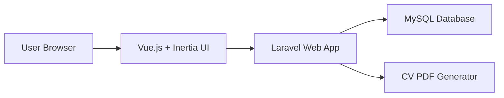
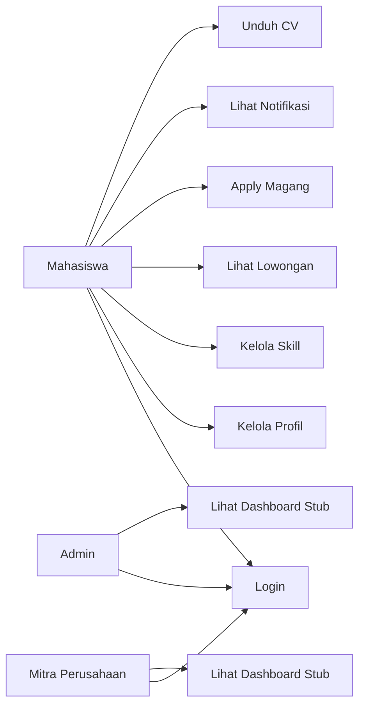
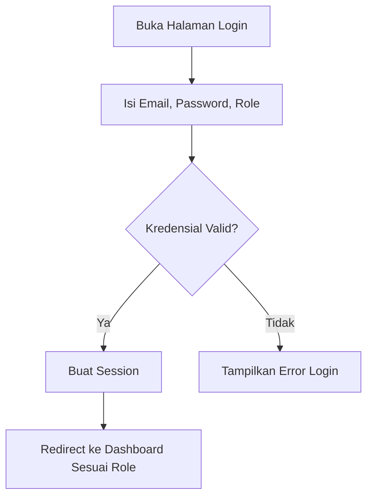
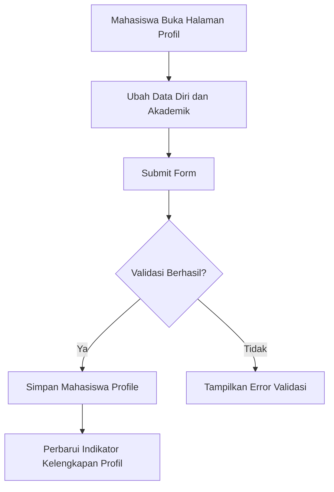
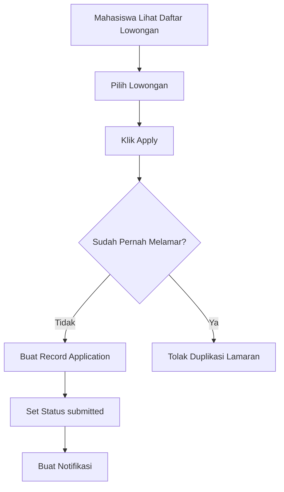
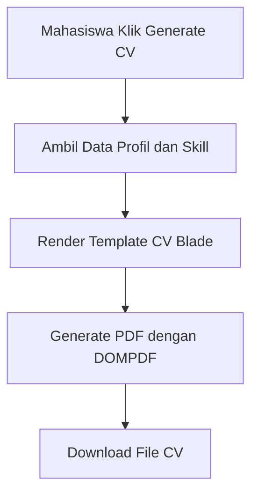
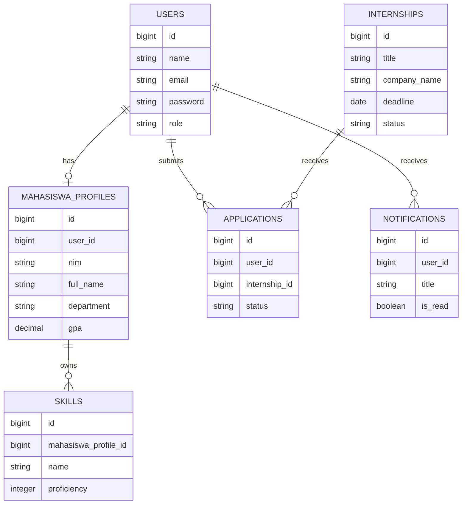

# Rancangan Sistem Sprint 1 SIKARA

## Arsitektur Tingkat Tinggi
SIKARA Sprint 1 dibangun sebagai aplikasi web monolitik menggunakan Laravel untuk backend, Vue.js dengan Inertia untuk antarmuka, MySQL untuk penyimpanan data, dan DOMPDF untuk pembuatan CV.

## Use Case Diagram

## Activity Flow
### Login

### Edit Profil Mahasiswa

### Apply Internship

### Generate CV

## Struktur Data
### Entitas Utama
- `users`: menyimpan email, password terenkripsi, dan role.
- `mahasiswa_profiles`: menyimpan identitas mahasiswa dan data akademik.
- `skills`: menyimpan skill mahasiswa dan persentase penguasaan.
- `internships`: menyimpan lowongan magang.
- `applications`: menyimpan relasi mahasiswa terhadap lowongan dan status lamaran.
- `notifications`: menyimpan notifikasi pengguna.

### ERD Konseptual

## Pemetaan Implementasi
- Autentikasi dan session: Laravel Breeze.
- Middleware role: `EnsureUserHasRole`.
- Dashboard role-based: `DashboardController`.
- Profil mahasiswa: `StudentProfileController`.
- Skill: `SkillController`.
- Magang dan pendaftaran: `InternshipController` dan `ApplicationController`.
- Notifikasi: `NotificationController`.
- CV PDF: `CvController` dan `resources/views/pdf/cv.blade.php`.

## Rute Sprint 1
- `POST /login`
- `POST /logout`
- `GET /dashboard`
- `GET /profile`
- `POST /profile`
- `POST /profile/skills`
- `GET /internships`
- `POST /internship-apply`
- `GET /notifications`
- `POST /notifications/{id}/read`
- `GET /cv/download`

## Batas Implementasi
- Event dan statistik tetap dimodelkan sebagai arah pengembangan berikutnya, namun belum diimplementasikan penuh pada Sprint 1.
- Dashboard perusahaan dan admin masih berperan sebagai placeholder fungsional agar validasi multi-role dapat diuji sejak awal.
